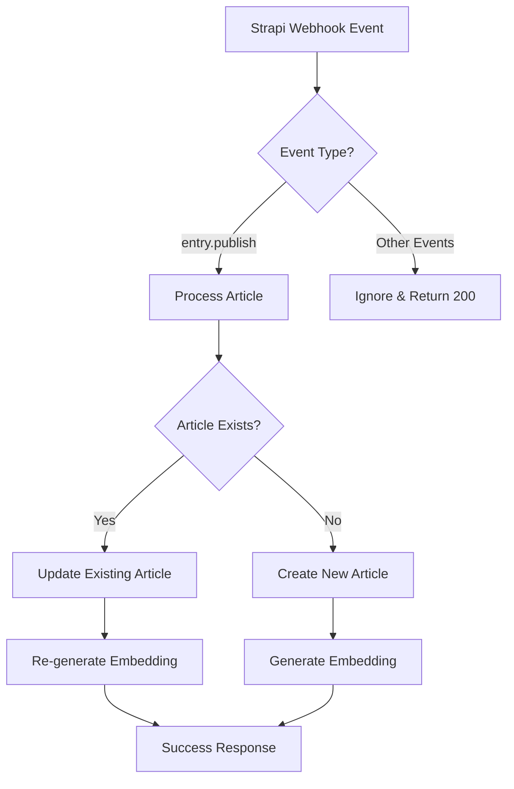

# Strapi Webhook Integration Documentation

## Overview

This system integrates Strapi CMS with Convex database through webhooks, enabling real-time synchronization of articles while maintaining compatibility with existing legacy WordPress data.

## Architecture

### Dual-Source Data System

The system handles articles from two sources:

1. **Legacy WordPress Articles** (imported via batch process)
2. **New Strapi Articles** (synced via webhooks)

Both sources coexist in the same `articles` table but are distinguished by their ID patterns.

## ID System & Data Separation

### Legacy Articles (WordPress Import)
```typescript
{
  original_id: 12345,           // WordPress post ID (number)
  strapi_document_id: undefined // Not set for legacy articles
}
```

### Strapi Articles (Webhook Sync)
```typescript
{
  original_id: null,                    // Always null for Strapi articles
  strapi_document_id: "abc123def456"    // Strapi document ID (string)
}
```

### Key Differences

| Field | Legacy Articles | Strapi Articles |
|-------|----------------|-----------------|
| `original_id` | WordPress post ID (number) | `null` |
| `strapi_document_id` | `undefined` | Strapi document ID (string) |
| Source | WordPress batch import | Strapi webhook |
| Update Method | One-time import | Real-time sync |

## Webhook Event Processing

### Supported Events

The webhook only processes `entry.publish` events:

```typescript
// ✅ Processed
"entry.publish"   // Article published in Strapi

// ❌ Ignored
"entry.create"    // Draft created
"entry.update"    // Draft updated  
"entry.unpublish" // Article unpublished
"entry.delete"    // Article deleted
```

### Event Flow



## Data Transformation

### Strapi to Convex Mapping

The `mapStrapiToConvex()` function transforms Strapi webhook data:

```typescript
// Strapi Webhook Payload
{
  id: 1347,
  documentId: "nl7jq3jmwqe7jb9oqurg39ln",
  title: "Article Title",
  content: "Article content...",
  channel: { original_id: 1 },
  contributor: { original_id: 765, wp_user_id: 123 },
  placefilter: "Featured"
}

// Transformed to Convex Format
{
  original_id: null,                           // Always null for Strapi
  strapi_document_id: "nl7jq3jmwqe7jb9oqurg39ln", // For tracking
  title: "Article Title",
  content: "Article content...",
  channel: 1,                                  // Extracted from relation
  author_id: 765,                             // contributor.original_id
  author_wpid: 123,                           // contributor.wp_user_id
  placefilter: 2,                             // Mapped: Featured = 2
  status: 1,                                  // Default for published
  publish_date: "2025-06-16",                 // Formatted date
  last_updated: "2025-06-16T19:53:05.908Z"    // Current timestamp
}
```

### Field Mappings

#### Enum Mappings
```typescript
// Placefilter mapping
"Latest" → 0
"Trending" → 1  
"Featured" → 2
```

#### Relationship Mappings
```typescript
// Channel relationship
entry.channel.original_id → articles.channel

// Contributor relationship  
entry.contributor.original_id → articles.author_id
entry.contributor.wp_user_id → articles.author_wpid
```

## Database Schema

### Articles Table Structure

```typescript
articles: {
  // Universal fields
  _id: Id<"articles">,
  _creationTime: number,
  title: string,
  content: string,
  // ... other content fields
  
  // ID tracking fields
  original_id: number | null,        // WordPress ID or null
  strapi_document_id?: string,       // Strapi document ID (optional)
  
  // Author relationships
  author_id: number | null,          // Contributor original_id
  author_wpid: number | null,        // WordPress user ID
  
  // Other relationships
  channel: number | null,            // Channel original_id
  
  // AI/Search
  embedding?: number[],              // Vector embedding for search
}
```

### Indexes

```typescript
// For legacy article lookups
.index("by_original_id", ["original_id"])

// For Strapi article lookups  
.index("by_strapi_document_id", ["strapi_document_id"])

// For relationship queries
.index("by_author_id", ["author_id"])
.index("by_channel", ["channel"])

// For vector search
.vectorIndex("by_embedding", {
  vectorField: "embedding",
  dimensions: 1536,
  filterFields: ["channel", "status"]
})
```

## Webhook Endpoint Implementation

### URL
```
POST /strapiWebhook
```

### Authentication
Currently no authentication required (consider adding webhook signature verification)

### Request Processing

1. **Parse JSON payload**
2. **Validate event type** (`entry.publish` only)
3. **Check for existing article** by `strapi_document_id`
4. **Transform data** using `mapStrapiToConvex()`
5. **Create or update** article
6. **Trigger embedding generation**
7. **Return success response**

## Publish/Unpublish/Republish Workflow

### Scenario: Article Lifecycle

```typescript
// 1. First Publish
POST /strapiWebhook
{
  event: "entry.publish",
  entry: { documentId: "abc123", title: "Test Article" }
}
// → Creates new article with strapi_document_id: "abc123"

// 2. Unpublish  
POST /strapiWebhook
{
  event: "entry.unpublish", 
  entry: { documentId: "abc123" }
}
// → Ignored (returns 200 but no processing)

// 3. Republish
POST /strapiWebhook  
{
  event: "entry.publish",
  entry: { documentId: "abc123", title: "Updated Article" }
}
// → Updates existing article (found by documentId)
// → Re-generates embedding with new content
```

## Embedding & Vector Search

### Automatic Vectorization

Both create and update operations trigger embedding generation:

```typescript
// Text prepared for embedding
const textToEmbed = [
  args.title,
  args.content, 
  args.subtitle,
  args.link
].join("\n\n");

// Scheduled for background processing
await ctx.scheduler.runAfter(0, internal.embeddingActions.generateEmbeddingAndUpdate, {
  articleId: articleId,
  textToEmbed: textToEmbed,
});
```

### Search Integration

The AI agent can search across all articles (legacy + Strapi) using vector similarity:

```typescript
// Agent searches both legacy and Strapi articles seamlessly
const results = await vectorSearch("by_embedding", {
  vector: queryEmbedding,
  limit: 10,
  filter: q => q.eq("status", 1) // Published only
});
```

## API Endpoints

### Query Articles by Source

```typescript
// Get legacy articles (has original_id)
const legacyArticles = await ctx.db.query("articles")
  .filter(q => q.neq(q.field("original_id"), null))
  .collect();

// Get Strapi articles (has strapi_document_id)  
const strapiArticles = await ctx.db.query("articles")
  .filter(q => q.neq(q.field("strapi_document_id"), undefined))
  .collect();
```

### Lookup by ID

```typescript
// Find legacy article by WordPress ID
const legacyArticle = await ctx.db.query("articles")
  .withIndex("by_original_id", q => q.eq("original_id", 12345))
  .unique();

// Find Strapi article by document ID
const strapiArticle = await ctx.db.query("articles") 
  .withIndex("by_strapi_document_id", q => q.eq("strapi_document_id", "abc123"))
  .first();
```

## Relationships & Data Integrity

### Contributors/Authors

```typescript
// Legacy articles reference WordPress users
{
  author_wpid: 123,    // WordPress user ID
  author_id: null      // May not have contributor mapping
}

// Strapi articles reference contributors
{
  author_wpid: 123,    // WordPress user ID (from contributor)
  author_id: 765       // Contributor original_id
}
```

### Channels

Both legacy and Strapi articles use the same channel system:

```typescript
// Both reference channels by original_id
{
  channel: 1,          // Channel original_id
  channel_url: null    // Legacy field, mostly unused
}
```

## Error Handling

### Common Issues

1. **Missing Relations**: If contributor/channel not found, fields set to `null`
2. **Validation Errors**: Malformed data logged and rejected
3. **Duplicate Processing**: `strapi_document_id` prevents duplicates

### Monitoring

Key log messages to monitor:

```typescript
// Success
"Successfully created article {id} from Strapi entry {strapiId}"
"Successfully updated article {id} from Strapi entry {strapiId}"

// Ignored events  
"Ignoring {event} event - only processing entry.publish"

// Errors
"Failed to process article from Strapi webhook: {error}"
```

## Migration Considerations

### Adding New Fields

When adding fields to Strapi:

1. Update `mapStrapiToConvex()` function
2. Add field to `createArticle` mutation args
3. Add field to `updateArticle` mutation args  
4. Update schema if needed
5. Consider legacy article compatibility

### Changing ID Systems

The dual-ID system allows for future migrations:

- Legacy articles can be gradually migrated to Strapi
- `original_id` preserved for backward compatibility
- `strapi_document_id` enables Strapi-native operations

## Performance Considerations

### Webhook Processing

- Events processed synchronously
- Embedding generation runs in background
- Database operations are atomic

### Search Performance

- Vector search indexes both legacy and Strapi content
- Channel/status filters improve query performance
- Embedding updates don't block webhook responses

## Security Considerations

### Current State
- No webhook authentication
- CORS enabled for all origins
- No rate limiting

### Recommendations
1. Add webhook signature verification
2. Implement rate limiting
3. Add API key authentication
4. Restrict CORS origins
5. Add request size limits

## Troubleshooting

### Common Issues

1. **Validation Errors**: Check field mappings in `mapStrapiToConvex()`
2. **Missing Articles**: Verify `strapi_document_id` is being set correctly
3. **Duplicate Articles**: Check if `getByDocumentId` query is working
4. **Search Issues**: Ensure embeddings are being generated

### Debug Steps

1. Check webhook logs for event processing
2. Verify article exists in database with correct IDs
3. Check embedding generation logs
4. Test vector search functionality

## Future Enhancements

### Planned Features
- Webhook signature verification
- Bulk sync endpoint for initial migration
- Article deletion handling
- Draft/preview support
- Media/asset synchronization

### Potential Improvements
- Caching layer for frequent queries
- Webhook retry mechanism
- Real-time status updates
- Advanced conflict resolution 